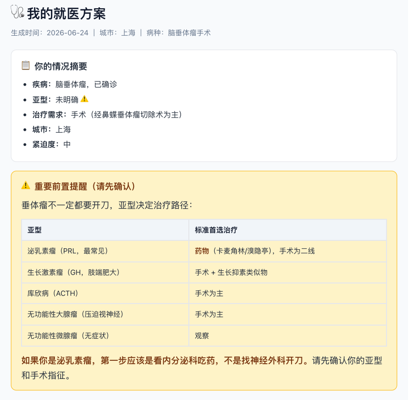
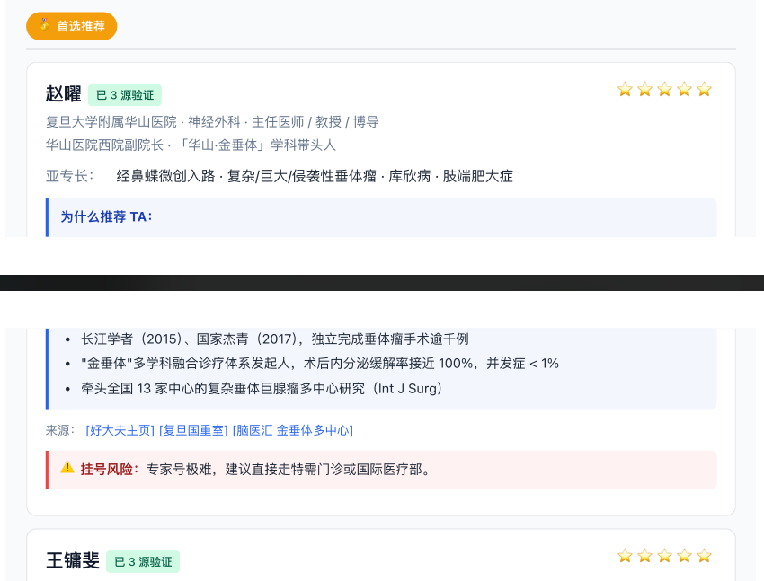
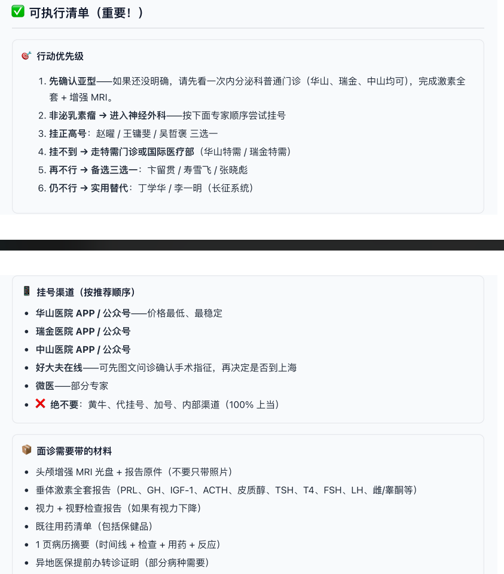

# 就医导航助手

[English](README.en.md)

面向没有医疗资源关系的普通患者，帮助在北京、上海、广州、深圳、成都、武汉和长沙等城市中，基于公开信息筛选合适的就诊医生或专家。它将信息收集、交叉验证、分层推荐和下一步行动清单组合为一个可复用工作流。

> 这是一项就医信息导航工具，不提供诊断或治疗意见，不能替代线下医生面诊；紧急情况请立即联系急救服务或前往最近的急诊。

## 能做什么

- 通过分组问诊收集病情、既往治疗、城市、时间和预算等必要约束
- 对候选医生执行多源搜索与独立交叉验证，降低姓名、科室和在职状态出错的风险
- 根据病种和患者限制动态评分，输出首选、备选与实用替代方案
- 给出预约渠道、挂号难度、材料准备、面诊问题和反黄牛提醒
- 生成可保存的 HTML 看板，便于持续跟进与启动备选方案

## 安装

从本仓库根目录执行：

```bash
mkdir -p ~/.claude/skills
cp -r find-doctor ~/.claude/skills/
```

重启 Claude Code 后，可在“帮我找医生”“某种病该挂哪个科”“推荐某城市的专家”等场景触发。

## 文件说明

- [SKILL.md](SKILL.md)：完整工作流、隐私规则、验证要求和输出规范
- [reference.md](reference.md)：病种分流、信息源优先级、评分权重、重点医院和风险提示
- [artifact-template.html](artifact-template.html)：医生推荐结果的可保存 HTML 看板模板

## 示例输出

以下为“上海垂体瘤手术”场景的**历史示例**（生成于 2026-06-24），展示技能如何把前置信息、分层推荐和行动清单组织为可保存看板。它仅用于说明输出形式，**不构成当前医生推荐、诊断或治疗建议**；其中的医生资料、出诊、费用与治疗路径均可能变化，使用前必须通过医院官方渠道和线下面诊再次核实。

[下载完整示例 PDF](examples/pituitary-tumor-surgery/pituitary-tumor-surgery-example.pdf) · [示例说明](examples/pituitary-tumor-surgery/README.md)

| 病情摘要与前置提醒 | 分层推荐卡片 |
|---|---|
|  |  |



## 使用原则

请不要输入真实姓名、身份证号、手机号、详细住址或未脱敏报告。医生任职和出诊信息可能变化，预约前必须通过医院官方渠道再次确认。不要使用加号、代挂号或所谓内部渠道。

## 许可证

本目录当前未附独立许可证；除适用法律另有规定外，请勿将其视为已获开源许可。
