# ppt-studio

> 一个 Claude Skill:9 步 Human-in-the-loop 工作流 × 22 个设计主题 × 15 个版式,生成可用 PowerPoint 编辑的 `.pptx`。

**核心信念:一份好 PPT 不是从写字开始的,而是从对齐目标开始的。** 一气呵成生成的 PPT 看起来省事,但风格、目标、事实任何一个环节出错,后面全部返工。所以这个 skill 把流程拆成 9 个固定步骤,每个关键节点都停下来等你确认。

## 特性

- **22 个主题 × 15 个版式,自由组合**——主题只是一组设计令牌(颜色/字体/圆角),版式函数只引用令牌、不写死任何色值,任意搭配不会破相
- **版式 DNA:每个主题有专属构图**——封面/幕封/金句/收束/大数字五个 hero 版式逐主题独立设计,任意两个主题并排,构图可辨识地不同,而不只是换色
- **9 步 HITL 工作流**——受众访谈 → 大纲审查 → 事实核查 → 页数规划 → 主题决策 → 风格预演 → spec-lock 锁定 → 一次性生成 → 逐页 QA
- **spec-lock 执行锁**——风格敲定后写入单一真值源,长 deck 逐页生成前重读,防止上下文漂移导致的风格走样
- **明暗节奏**——每个主题的 hero 页(封面/幕封/金句/收束)与内容页使用不同底色,自动形成呼吸感
- **输出真正的 .pptx**——基于 [pptxgenjs](https://github.com/gitbrent/PptxGenJS),可在 PowerPoint / Keynote / WPS 里继续编辑,含演讲者备注
- **零重型依赖**——引擎只依赖 pptxgenjs 一个 npm 包

## 主题预览(22 个 · 8 大场景)

| | | | |
|---|---|---|---|
|  经典深蓝 | 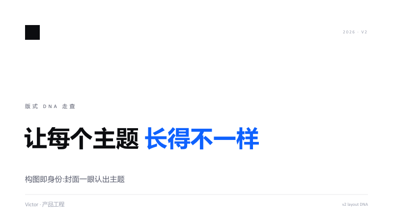 极简灰白 |  科研答辩 | 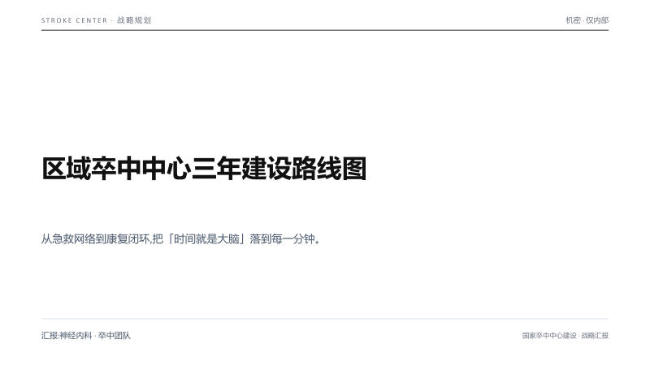 麦肯锡蓝灰 |
|  清爽专业 |  数据仪表盘 |  杂志·墨水经典 | 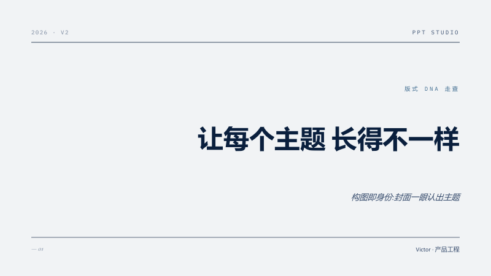 杂志·靛蓝瓷 |
| 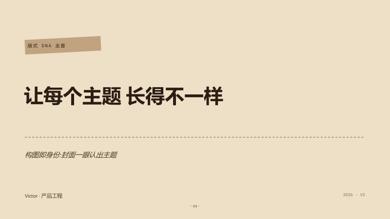 杂志·牛皮纸 | 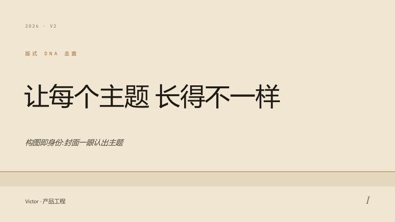 杂志·沙丘 |  瑞士·克莱因蓝 | 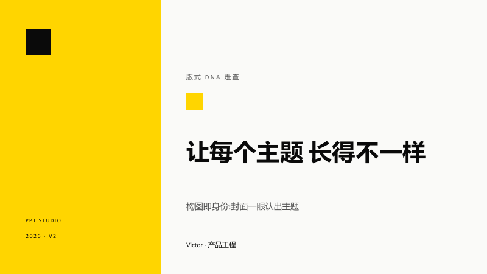 瑞士·柠檬黄 |
| 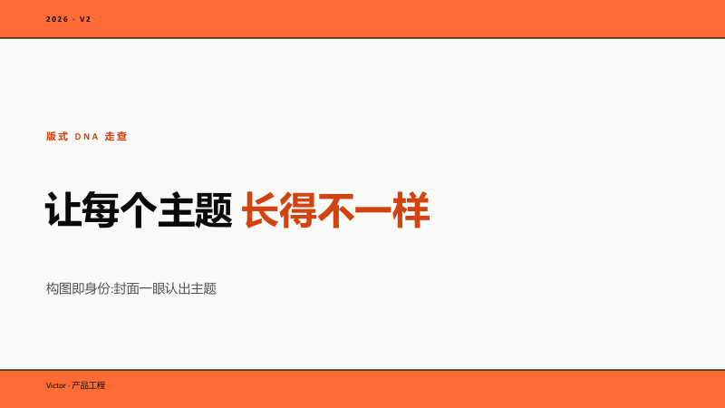 瑞士·安全橙 | 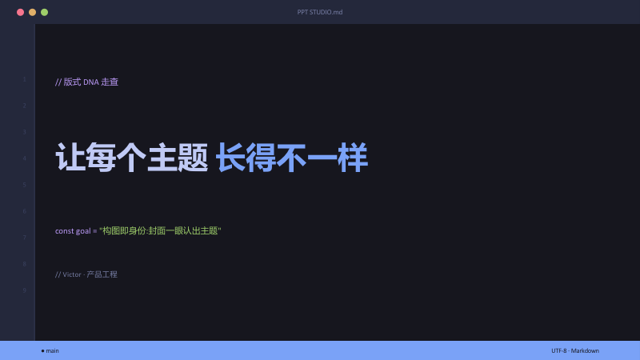 东京夜 | 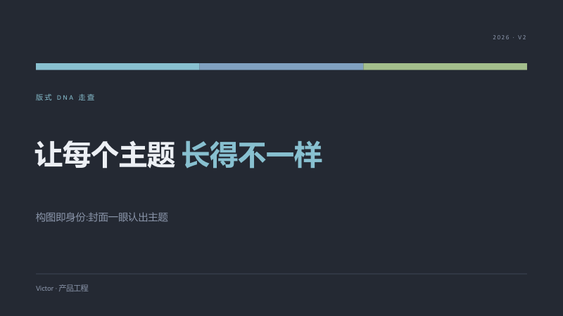 北欧冷蓝 | 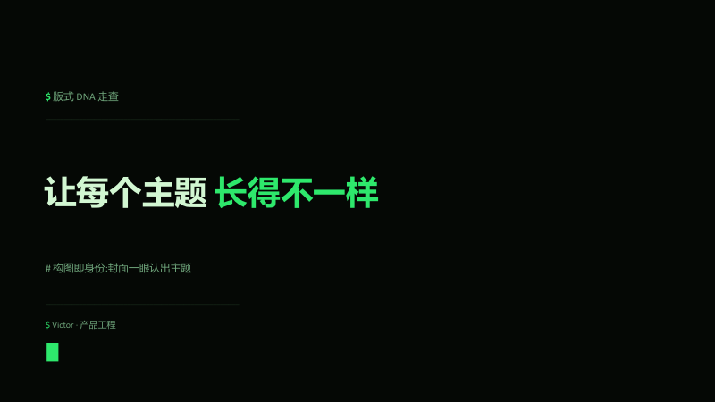 绿屏终端 |
| 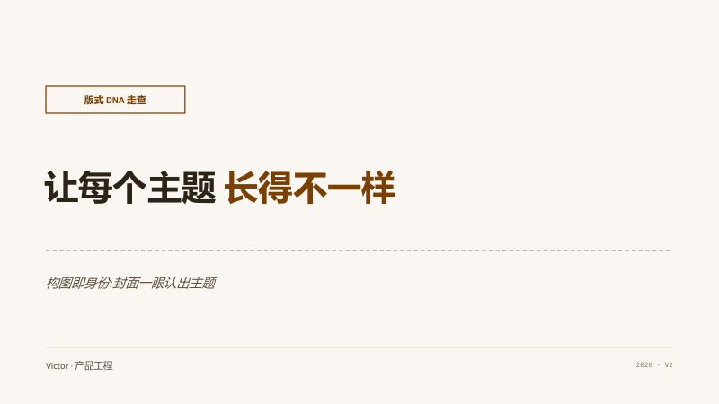 暖色学术 |  柔和粉彩 | 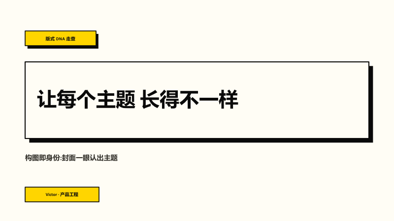 新粗野 | 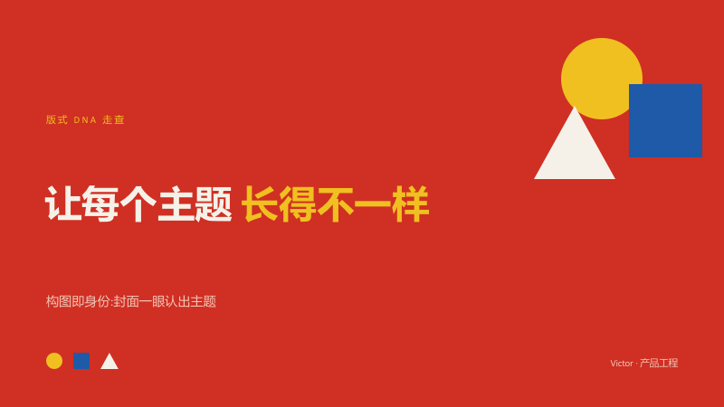 包豪斯 |
| 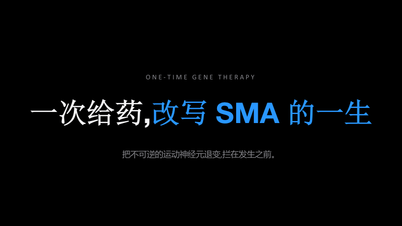 发布会·夜幕 |  发布会·晨光 | | |

每个主题的完整色板、字体、适用场景与推荐矩阵见 [references/theme-gallery.md](references/theme-gallery.md)。

## 15 个版式

`cover` 封面 · `toc` 目录 · `sectionDivider` 章节幕封 · `statement` 金句 · `contentRows` 编号要点 · `twoColumn` 双栏 · `threeCards` 三卡 · `comparison` 对比 · `imageText` 左文右图 · `kpiGrid` KPI 卡片 · `bigStat` 大数字柱状 · `timeline` 时间线 · `table` 表格 · `processSteps` 步骤卡 · `closing` 收束页

参数签名与容量限制见 [references/layout-catalog.md](references/layout-catalog.md)。

---

## 安装

### 前置要求

- [Claude Code](https://claude.com/claude-code) 或支持 Skill 的 Claude 客户端(Claude Desktop / Cowork)
- Node.js ≥ 18(引擎生成 .pptx 用)

### 方式一:作为 Claude Code 个人 skill(推荐)

本项目托管在技能合集仓库 [VictorZheng0504/Skill_sharing](https://github.com/VictorZheng0504/Skill_sharing) 的 `ppt-studio/` 子目录:

```bash
git clone https://github.com/VictorZheng0504/Skill_sharing.git
mkdir -p ~/.claude/skills
cp -r Skill_sharing/ppt-studio ~/.claude/skills/
```

重启 Claude Code 后,对它说"帮我做 PPT"即可触发。

### 方式二:项目级 skill

放进某个项目的 `.claude/skills/` 目录,仅该项目可用:

```bash
cp -r ppt-studio <你的项目>/.claude/skills/
```

### 方式三:打包为 .skill 文件

支持 `.skill` 导入的客户端(如 Claude Desktop)可直接导入打包文件:

```bash
cd ppt-studio/.. && zip -r ppt-studio.skill ppt-studio -x "*.git*" "*docs/previews*" "*.DS_Store"
```

### 引擎运行环境(首次生成时)

Skill 生成 PPT 时会在工作目录安装唯一依赖:

```bash
npm i pptxgenjs
```

不需要 PowerPoint——生成过程纯 Node.js,产物是标准 OOXML 的 `.pptx` 文件。

---

## 快速上手

### 配合 Claude 使用(完整 9 步工作流)

把大纲丢给 Claude 并说"帮我把这份大纲做成 PPT",它会:

1. 用结构化问卷一次问清**受众 / 时长 / 目标 / 用途**
2. 润色大纲(修改前后对照)→ 等你确认
3. 列出高风险事实清单 → 问你是否要联网核查
4. 给出**页面清单**(每页的版式与核心信息)→ 等你确认
5. 从 22 个主题里**推荐 1 + 备选 2** → 你来选
6. 只生成 2 页预演风格 → 不满意可低成本换向
7. 通过后写入 spec-lock,一次性生成全部页面,逐页 QA
8. 交付 .pptx + QA 总结

### 直接用引擎(跳过工作流)

```js
const { createDeck, listThemes } = require("./assets/deck_engine");

const d = createDeck("swiss-ikb", {
  title: "我的演讲", author: "你的名字",
  footer: "页脚品牌语", slogan: "封面右下角小字",
});

d.S.cover({
  kicker: "KEYNOTE 2026",
  title: [["把想法", false], ["讲清楚", true]],   // true = 强调色
  subtitle: "一句话副标题", speaker: "主讲:某某",
});
d.S.contentRows({
  kicker: "方法", title: "三个步骤",
  rows: [["01", "对齐目标", "受众、时长、目标、用途"],
         ["02", "锁定风格", "spec-lock 固化决策"],
         ["03", "逐页生成", "每页 QA 自检"]],
  page: "02", notes: "这页的演讲者备注",
});
d.S.closing({ kicker: "THANKS", title: [["谢谢", false]], cta: "github.com/VictorZheng0504/Skill_sharing" });

d.save("my-deck.pptx");
```

```bash
npm i pptxgenjs && node build.js
```

---

## 目录结构

```
ppt-studio/
├── SKILL.md                        # 9 步工作流主文档(Claude 读这个)
├── references/
│   ├── interview-template.md       # Step 1 访谈问卷
│   ├── theme-gallery.md            # 22 主题库 + 场景推荐矩阵 + 字体说明
│   ├── layout-catalog.md           # 15 版式目录 + 参数签名 + 容量限制
│   ├── spec-lock-template.md       # 执行锁模板与规则
│   └── qa-checklist.md             # 逐页 QA 清单
├── assets/
│   ├── deck_engine.js              # 版式引擎(唯一依赖 pptxgenjs)
│   └── themes.json                 # 20 组设计令牌
└── docs/previews/                  # 主题预览图(README 用)
```

## 字体说明

主题的理想字体多为开源字体,**未安装时自动回退到系统字体,不会报错**,但观感有损:

| 字体 | 影响主题 | 下载 |
|---|---|---|
| 思源宋体 / 思源黑体(Noto Serif/Sans SC) | 学术系、杂志系 | [Google Fonts](https://fonts.google.com/noto/specimen/Noto+Serif+SC) |
| Inter | 瑞士系、极简系、仪表盘 | [rsms.me/inter](https://rsms.me/inter/) |
| JetBrains Mono | 深色系、terminal-green | [jetbrains.com/mono](https://www.jetbrains.com/lp/mono/) |
| Playfair Display | 杂志系英文大字 | [Google Fonts](https://fonts.google.com/specimen/Playfair+Display) |

零安装保险组合:`mckinsey` / `clean-pro` / `warm-academic`。换机放映前请在放映机器上确认字体。

## FAQ

**Q: 可以自定义配色吗?**
不接受单点改 hex——20 套配色是成套调过对比度的,单改一个值很容易破坏可读性。品牌定制请复制一份主题令牌整套修改(`assets/themes.json`),并自行检查对比度(正文 ≥ 4.5:1)。

**Q: 深色主题能打印吗?**
不建议。深色底费墨、打印对比度差。需要讲义时用浅色主题重新生成(引擎换主题 = 改一个参数)。

**Q: 为什么输出 .pptx 而不是 HTML 幻灯片?**
为了可编辑性——生成后你可以在 PowerPoint 里继续微调。代价是放弃了 CSS 动效与渐变文字,引擎翻译的是版式骨架 + 色板 + 字体层级。

**Q: 生成到一半改主意换主题怎么办?**
改 spec-lock 里的 `theme_id`,重跑生成脚本——版式与内容代码一行都不用动。

## 参考与致谢

本项目的模板体系与工作流设计,站在以下四个开源项目的肩膀上。向各位作者的分享精神致以诚挚感谢:

| 项目 | 作者 | 许可证 | 本项目借鉴的内容 |
|---|---|---|---|
| [ppt-master](https://github.com/hugohe3/ppt-master) | [@hugohe3](https://github.com/hugohe3) | MIT | spec-lock「单一真值源」执行锁机制;逐页生成前重读规范、防止长 deck 风格漂移的工程纪律;品牌与布局解耦的模块化思路 |
| [guizang-ppt-skill](https://github.com/op7418/guizang-ppt-skill) | [@op7418](https://github.com/op7418)(归藏) | AGPL-3.0 | 「配色预设制」理念(只提供成套配色,不接受自定义 hex);hero 页与内容页交替的明暗节奏规则;杂志风四套纸墨配色与瑞士风三色的色彩灵感 |
| [html-ppt-skill](https://github.com/lewislulu/html-ppt-skill) | [@lewislulu](https://github.com/lewislulu) | MIT | 本项目最核心的架构灵感——「一套语义化设计令牌 + N 个主题只覆盖令牌取值 + 版式只引用令牌」;主题库的场景化分类方式;tokyo-night / nord 等深色主题选型 |
| [codex-ppt-skill](https://github.com/ningzimu/codex-ppt-skill) | [@ningzimu](https://github.com/ningzimu) | MIT | 多级审批门(approval gates)的 Human-in-the-loop 工作流设计;样本页通过后作为全 deck 风格锚点的做法;按「适用场景」而非「颜色」组织风格库的分类准则 |

同时感谢 [PptxGenJS](https://github.com/gitbrent/PptxGenJS)(MIT)——本项目引擎的唯一运行时依赖。

**独立实现声明**:本项目引擎(`assets/deck_engine.js`)基于 pptxgenjs 公开 API 从零编写,SKILL.md 与全部文档为原创撰写,未复制上述任何项目的代码、模板或文档文本;对 guizang-ppt-skill(AGPL-3.0)仅参考了配色数值与设计理念,不构成其衍生作品。如上述项目作者认为署名方式有不妥之处,欢迎提 issue 联系调整。

## License

[MIT](LICENSE)
